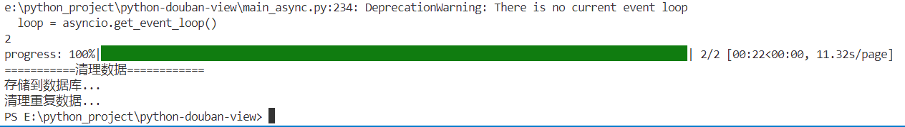
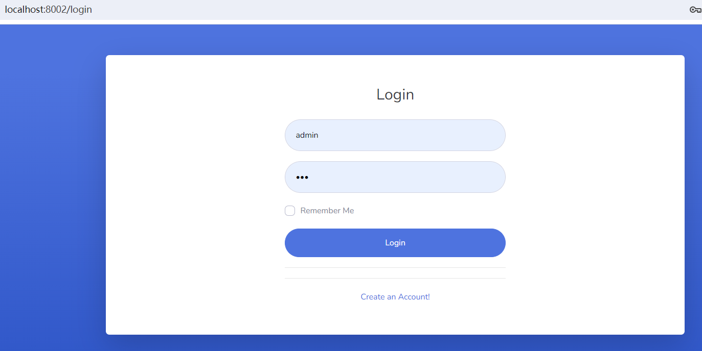
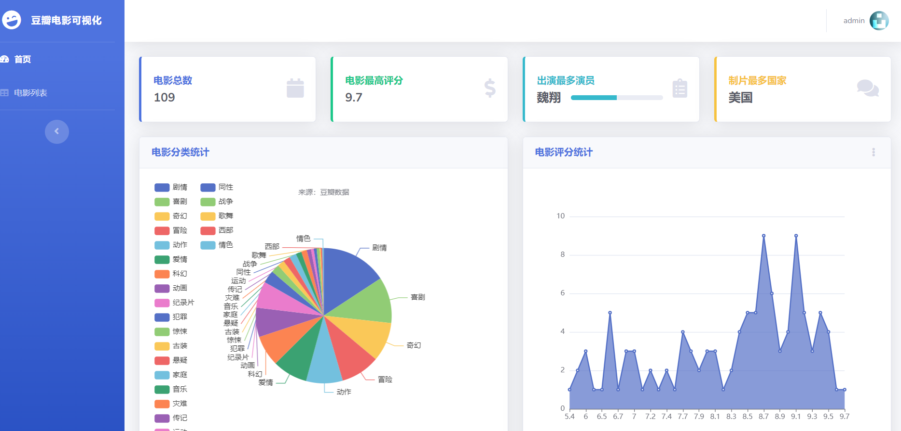

## 部署说明
1. 创建mysql数据库 `db_douban`，执行doc/`db_douban.sql`
2. 请分别修改db_query.py和main_async.py中的数据库连接信息
3. 首次运行请删除`movie_data.csv`和`page_progress.json`两个文件
4. 运行`main.py`或者异步的`main_async.py`,异步运行会更快，要获取的电影分类和页码请在程序中自行调整

5. 爬取完成后，运行`app.py`，然后浏览器访问`http://127.0.0.1:8002/`

## 打赏作者
觉得本项目对你有帮助的话，请作者喝杯吧！

